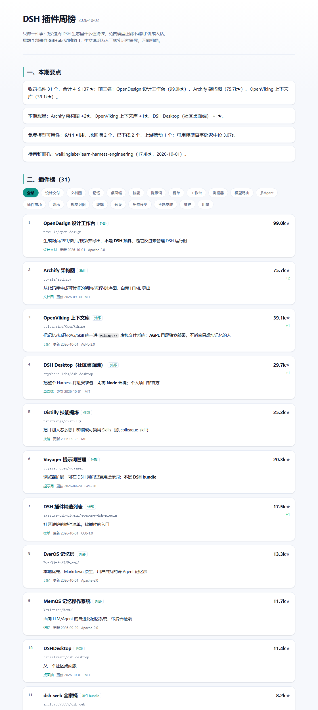

# DSH 插件周榜（dsh-weekly-check）

一份**全自动、每周更新**的中文周报，回答两件事：

1. **这周 DSH（DeepSeek Harness）生态里哪些插件值得装？** —— 带中文说明、真实星数、本周涨星。
2. **那些"免费无限用"的模型，现在还能用吗？** —— 真跑一次补全，逐个给出可用/限流/地区墙/已下线/上游波动。

发布形态是一个**自包含单文件 HTML**，托管在 GitHub Pages，零成本、零依赖、无需服务器。



**在线看板**：https://514006234.github.io/dsh-weekly-check/

---

## 为什么这件事值得做

- DSH 生态里插件仓库已经有上万个，但**几乎全是英文描述**，中文用户根本挑不出来；
- `topic:dsh-plugin` 标签被大量蹭流量的高星项目污染（24 万星的是 harness 本体、4 万星的是简历生成器），**按星数排序毫无意义**；
- "免费模型"清单类文章全是**静态截图**，写完之后模型早就下线了；
- 于是「**人工策展的中文说明 + 机器实时验证的硬数据**」就成了一个真需求。

## 目录结构

```
tools/rank-plugins.mjs         插件榜数据源：策展白名单 + GitHub 实时星数 + 涨星对比 + 新星扫描
tools/survey-free-models.mjs   免费模型数据源：真实调用一遍，区分"真下线"和"上游抽风"
tools/build-report.mjs         合成周报：report/index.md + report/index.html + 归档
tools/sponsor.mjs              赞助推荐位：登记 / 下架（只在真实到账后登记；周报里独立成栏并标注「赞助」）
tools/selftest.mjs             离线回归自测：隔离在临时目录里跑，不碰真实数据、不联网
data/stars.json                星数缓存（实时刷新失败时的兜底）
data/history.json              每次运行的星数快照，用来算"较上期"
report/index.html              当期周报（发布这个文件）
report/archive/<日期>.md|html  历史留档
.github/workflows/weekly.yml   每周一 09:00（北京时间）自动跑 + 发布 Pages + 归档回仓库
site/sponsor.html              商务合作页（模板；收款链接/联系方式在 site/config.json 里配）
site/config.json               收款链接与联系方式（留空则页面自动降级为占位说明）
packages/dsh-weekly-panel/     DSH 插件：把周榜搬进侧边栏（可 dsh plugin add；界面改动需重启 DSH）
```

## 在 DSH 界面里直接看榜（插件）

`packages/dsh-weekly-panel` 是一个**真实可安装**的 DSH 插件：侧边栏底部的「📊 周榜」入口，点开是不遮挡对话的内联抽屉——
插件榜 TOP 10（中文名 + 实时星数 + 较上期涨星）、免费模型可用性、以及一块**明确标注「赞助」**的推荐位。

它只读：仅从本站读取 `latest.json`（服务端 fetch + 30 分钟缓存 + loopback 同源护栏），不写文件、不读本地文件、不转发任何请求头。

```bash
node packages/dsh-weekly-panel/tools/gate.mjs          # 24 项静态门禁（契约/边界/槽位/沙箱）
node packages/dsh-weekly-panel/tools/render-test.mjs   # 91 项渲染断言（假 ctx 模拟点击/失败/畸形数据）
```

装进本机 profile（会自动备份 + 校验 JSON 是否带 BOM，出错自动回滚）：

```bash
node tools/deploy-panel.mjs              # 安装
node tools/deploy-panel.mjs --check      # 看当前状态
node tools/deploy-panel.mjs --uninstall  # 一键撤销
```

> 桌面端插件的界面改动**必须完全重启 DSH 才会生效**（客户端 bundle 在启动时快照）——这不是 bug，是载体行为。

## 本地运行

需要 Node.js 20+（用到内置 `fetch`）。

```bash
node tools/rank-plugins.mjs            # 插件榜（Markdown 表格）
node tools/survey-free-models.mjs      # 免费模型体检（约 2–5 分钟）
node tools/build-report.mjs            # 采集并生成 report/
node tools/build-report.mjs --offline  # 不联网，用上次采集的数据重渲染
node tools/sponsor.mjs list            # 看当前赞助位（add / remove 见 COMMERCIAL.md）
npm test                               # 离线回归自测（不碰真实数据、不联网）
```

临时改 API 基址（自测或走企业代理）：`DSH_GH_API=https://npm-proxy.internal/api node tools/rank-plugins.mjs`。

想拿满 GitHub 配额（5000 次/小时、GraphQL 批量取 31 个仓库只要 1 次请求）：

```bash
GITHUB_TOKEN=ghp_xxx node tools/build-report.mjs
```

免费模型那一步会**复用 `dsh-our-free-model` 插件自己的源码**（`src/upstream.js`）来构造请求，
保证测的就是插件真实走的传输与指纹。脚本按这个顺序找插件源码：

1. `--plugin <目录>`
2. 环境变量 `DSH_PLUGIN_SRC`
3. `./dsh-our-free-model`（仓库根目录，CI 里就是 clone 到这里）
4. `~/.dsh/profiles/node_modules/dsh-our-free-model`（本机已装的副本）

都找不到时会跳过该章节，不影响整期发布。

## 发布到 GitHub Pages

1. 新建仓库，把本目录推上去（`main` 分支）：

   ```bash
   git init && git add . && git commit -m "feat: DSH 插件周榜 MVP"
   git branch -M main
   git remote add origin git@github.com:<你的用户名>/<仓库名>.git
   git push -u origin main
   ```

2. 仓库 **Settings → Pages → Build and deployment → Source 选 `GitHub Actions`**。
3. 仓库 **Settings → Actions → General → Workflow permissions 选 `Read and write permissions`**
   （归档步骤要 `git push` 回仓库；`GITHUB_TOKEN` 是 Actions 自动注入的，不用自己配）。
4. 手动跑一次验证：**Actions → 每周插件榜 → Run workflow**。成功后访问
   `https://<你的用户名>.github.io/<仓库名>/`。

## 数据可信度

| 数据 | 来源 | 口径 |
|---|---|---|
| 星数 / 更新时间 / 许可 | GitHub API（GraphQL 优先，REST 兜底） | 实时；取不到时用上期快照并在报告里标 `≈` |
| 中文名 / 中文说明 / 形态 | **人工策展** | 不做机翻；"原生bundle"= 能直接装进 DSH profile |
| 免费模型可用性 | **真实调用**（一条极短补全） | 走插件自己的传输与指纹；地区墙受出口 IP 影响 |
| "上游波动" vs "已下线" | 自动分类 + 自动重试 | 5xx/超时/keep-alive 只算波动；400 明确报不可用才算下线 |

## 已知限制

- 策展白名单是**手工维护**的：新插件靠每周自动扫描进"待审新面孔"，核实后才进正式榜。
- 免费模型结论与**出口 IP 所在地区**强相关（同一模型换地区结论会变）。
- 涨星对比需要至少两次运行；**首期没有"较上期"**，第二周起才有。
- Pages 是静态文件，搜索/筛选在前端完成，不收集任何访问数据。

## 后续可以加（按性价比排序）

1. **涨星 TOP 榜单独成栏**：`data/history.json` 已按周落盘，现在的"较上期"是表内一列，可以再抽一个"本周涨星 TOP10 / 新收录 / 掉榜"板块。
2. **RSS + 邮件推送**：`report/archive/*.md` 已是现成内容源。
3. **一键安装命令**：给每个"原生bundle"生成 `dsh plugin add <repo>` 的复制按钮。
4. **赞助位 / 定制榜单**：面向插件作者的曝光位，以及"企业内网可信插件白名单"定制报告。

## 许可

本仓库的策展文案与脚本为原创，可自由转载（注明来源）。
被收录项目的名称、说明与许可以其各自仓库为准。
